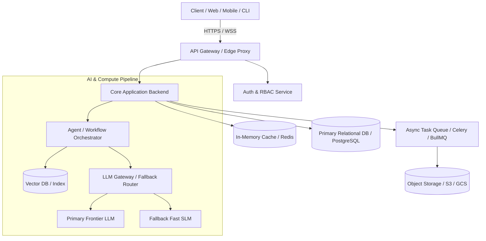

# Technical Specification Document

**System / Product Name:** <Product Name>  
**Status:** DRAFT / APPROVED  
**Author:** AI Systems Architect & Tech-Path Optimizer  
**Version:** 1.0.0  
**Target Delivery Window:** Phase 1 (MVP)  

---

## 1. System Overview & Architectural Topology

<Brief 2-3 paragraph executive technical summary explaining the architectural philosophy, core tech stack, and primary design trade-offs.>



---

## 2. Core Components & Subsystem Breakdown

| Subsystem | Technology Selection | Justification & License | Latency SLA | Fallback Strategy |
|---|---|---|---|---|
| **API Gateway / Routing** | FastAPI / Next.js / Envoy | Async I/O, OpenAPI auto-gen, MIT | < 25ms | Static edge cached response |
| **Primary Database** | PostgreSQL + Prisma/SQLAlchemy | ACID compliance, JSONB flexibility, Apache 2.0 | < 15ms | Read replicas / connection pooler |
| **Vector Database** | Qdrant / Pinecone / pgvector | Hybrid search (dense + sparse), low memory footprint | < 50ms | Keyword search (PostgreSQL FTS) |
| **AI / LLM Orchestration** | LangGraph / LiteLLM / Custom router | Deterministic state machine, multi-provider retry | < 1500ms | Rule-based triage / Cache hit |
| **Async Task Processing** | Redis + Celery / BullMQ / Temporal | Reliable job queues, exponential backoff | Async (<5s) | Dead letter queue + retry alert |
| **Auth & Security** | Supabase Auth / Clerk / NextAuth | OAuth2, OIDC, SOC2 ready, MFA support | < 50ms | Token revocation list |

---

## 3. Data Flow & Interface Contracts (API Specs)

### 3.1 Primary Workflow Contract
`POST /api/v1/research/execute`

**Request Payload:**
```json
{
  "product_name": "string (required, 1-100 chars)",
  "brief_text": "string (required, min 50 chars)",
  "constraints": {
    "target_timeline_months": 6,
    "budget_usd": 50000,
    "compliance_tier": "GDPR_SOC2"
  },
  "deep_scout": true
}
```

**Response Payload (200 OK):**
```json
{
  "job_id": "job_98472a",
  "status": "COMPLETED",
  "viability_score": 78.5,
  "classification": "Conditional Proceed",
  "cpi_summary": {
    "top_pain_cpi": 64.0,
    "pain_band": "Acute"
  },
  "deliverables": {
    "assessment_report_url": "s3://.../report.md",
    "technical_spec_url": "s3://.../tech-spec.md"
  },
  "execution_metrics": {
    "total_duration_ms": 3200,
    "tokens_consumed": 14200,
    "total_compute_cost_usd": 0.042
  }
}
```

---

## 4. Database Schema & Data Modeling

### 4.1 Relational Schema (PostgreSQL DDL)
```sql
CREATE TABLE users (
    id UUID PRIMARY KEY DEFAULT gen_random_uuid(),
    email VARCHAR(255) UNIQUE NOT NULL,
    org_id UUID REFERENCES organizations(id),
    created_at TIMESTAMP WITH TIME ZONE DEFAULT NOW()
);

CREATE TABLE product_runs (
    id UUID PRIMARY KEY DEFAULT gen_random_uuid(),
    user_id UUID REFERENCES users(id),
    product_slug VARCHAR(100) NOT NULL,
    viability_score NUMERIC(4, 1),
    verdict VARCHAR(50),
    status VARCHAR(30) DEFAULT 'INITIALIZED',
    metadata JSONB DEFAULT '{}'::jsonb,
    created_at TIMESTAMP WITH TIME ZONE DEFAULT NOW()
);

CREATE TABLE evidence_ledger (
    id VARCHAR(50) PRIMARY KEY, -- E-MKT-001
    run_id UUID REFERENCES product_runs(id) ON DELETE CASCADE,
    claim TEXT NOT NULL,
    tier VARCHAR(5) NOT NULL, -- T1, T2, T3, T4
    source_url TEXT NOT NULL,
    confidence NUMERIC(3, 2) NOT NULL,
    contradicts_id VARCHAR(50),
    created_at TIMESTAMP WITH TIME ZONE DEFAULT NOW()
);
```

---

## 5. Non-Functional Requirements & Performance SLAs

| Metric | Target SLA | Benchmark / Enforcement Method |
|---|---|---|
| **API p95 Latency** | < 250ms (Non-AI queries) | Locust load testing, Datadog APM tracing |
| **AI Stream TTFT** | < 800ms (Time-to-first-token) | Streaming SSE endpoints via edge proxies |
| **Availability** | 99.9% Uptime (<43 mins downtime/mo) | Multi-AZ deployment with auto-healing |
| **Throughput Capacity** | 500 RPS sustained, 2000 RPS burst | Horizontal Pod Autoscaling (HPA) |
| **Security Standards** | OWASP Top 10 mitigated, TLS 1.3 | Automated Snyk & Semgrep CI/CD scans |

---

## 6. AI & Compute Infrastructure Specification

- **Context Window Budgeting:**
  - System Instructions: 1,500 tokens
  - Retrieved Context & Grounding Evidence: 4,000 tokens
  - User Input & History: 2,500 tokens
  - Output Generation Budget: 2,000 tokens
- **Inference Cost Economics:**
  - Cost per single execution: `~$0.035 USD`
  - Monthly compute per active user (50 sessions/mo): `$1.75 USD`
  - ARPU: `$30.00 USD` $\rightarrow$ **AI COGS = 5.8% of ARPU** *(Safe: < 20% limit)*
- **Deterministic Guardrails & Error Fallbacks:**
  - Structured JSON Schema enforcement via Pydantic / Instructor.
  - Exponential backoff with jitter on HTTP 429 / 503.
  - Multi-model fallback: Primary Frontier LLM $\rightarrow$ Secondary Fast SLM $\rightarrow$ Rule-based heuristic cache.

---

## 7. Security, Privacy & Compliance Architecture

- **Zero-Data Retention Agreements:** Configured enterprise LLM API headers ensuring prompt inputs are not logged or used for model training.
- **Data Residency:** Isolated EU / US cloud database regions.
- **PII Scrubbing:** Pre-processing regex & Presidio masking for emails, phone numbers, and API keys prior to vector storage.
- **Role-Based Access Control (RBAC):** `Viewer`, `Editor`, `Admin`, `Auditor` scopes enforced at the API gateway layer.

---

## 8. 24-Month Total Cost of Ownership (TCO) Model

| Cost Category | Phase 1 (MVP, 100 Users) | Phase 2 (Growth, 1k Users) | Phase 3 (Scale, 10k Users) |
|---|---|---|---|
| **Compute & Hosting (AWS/GCP)** | $120 / mo | $450 / mo | $2,200 / mo |
| **Database & Vector DB** | $80 / mo | $300 / mo | $1,100 / mo |
| **AI Model API Invocations** | $175 / mo | $1,750 / mo | $14,000 / mo |
| **Third-Party Auth & Monitoring**| $50 / mo | $200 / mo | $800 / mo |
| **Total Monthly Infrastructure** | **$425 / mo** | **$2,700 / mo** | **$18,100 / mo** |
| **Gross Margin @ Target Pricing**| **82.5%** | **78.4%** | **76.2%** |

---

## 9. Phase 0 Technical Spikes (Pre-Build Proofs)

1. **Spike 1: Agentic Streaming Latency**
   - *Question:* Can multi-agent evidence synthesis stream the first token in < 800ms?
   - *Pass Criterion:* p95 TTFT < 800ms under 50 concurrent requests.
2. **Spike 2: Vector Retrieval Accuracy**
   - *Question:* Does hybrid dense + sparse search achieve >90% recall on technical claim extraction?
   - *Pass Criterion:* MRR@10 > 0.88 on golden benchmark dataset.
